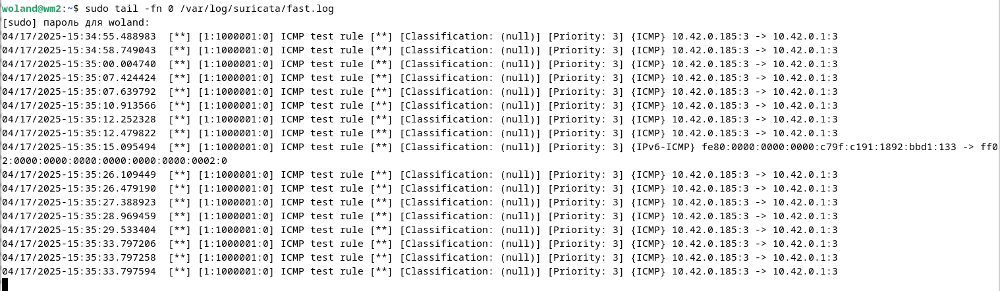

# Домашнее задание к занятию "`Защита сети`" - `Барышков Михаил`

## Задание 1

Проведите разведку системы и определите, какие сетевые службы запущены на защищаемой системе:

**sudo nmap -sA < ip-адрес >**

**sudo nmap -sT < ip-адрес >**

**sudo nmap -sS < ip-адрес >**

**sudo nmap -sV < ip-адрес >**

По желанию можете поэкспериментировать с опциями: https://nmap.org/man/ru/man-briefoptions.html.

*В качестве ответа пришлите события, которые попали в логи Suricata и Fail2Ban, прокомментируйте результат.*

------

## Решение 1

**Вывод:** Это TCP ACK сканирование которое показывает, настроен ли у нас брандмауэр. По ответам видно, что у нас нет активного (активных правил) Бранмауэра.

Файл fast.log в системе Suricata отвечает за регистрацию подозрительной активности. Т.к. мы настроили интеграцию между fail2ban и suricata в логах fail2ban мы видим ту же информацию.

**Вывод:** Это TCP сканирование с использованием системного вызова connect позволило выявить октрытые TCP порты и службы запущенные на них

Ни SURICATA ни Fail2Ban с дефолтными правилами не обнаружили ничего подозрительного.

**Вывод:** Аналогично TCP SYN

Снова ни SURICATA ни Fail2Ban с дефолтными правилами не обнаружили ничего подозрительного, что не удивительно.

**Вывод:** Дополнительная инофрмация об операционной системе, версии протакола и т.д.

Видно как появились несколько новых записей в логе и были заблокированны 2 IP адреса

------

## Задание 2

Проведите атаку на подбор пароля для службы SSH:

**hydra -L users.txt -P pass.txt < ip-адрес > ssh**

1. Настройка **hydra**: 
 
 - создайте два файла: **users.txt** и **pass.txt**;
 - в каждой строчке первого файла должны быть имена пользователей, второго — пароли. В нашем случае это могут быть случайные строки, но ради эксперимента можете добавить имя и пароль существующего пользователя.

Дополнительная информация по **hydra**: https://kali.tools/?p=1847.

2. Включение защиты SSH для Fail2Ban:

- открыть файл /etc/fail2ban/jail.conf,
- найти секцию **ssh**,
- установить **enabled**  в **true**.

Дополнительная информация по **Fail2Ban**:https://putty.org.ru/articles/fail2ban-ssh.html.

*В качестве ответа пришлите события, которые попали в логи Suricata и Fail2Ban, прокомментируйте результат.*

------

## Решение 2

1.
 

2. 

**Выводы**

- Hydra быстро подбирает слабые пароли, если они есть в pass.txt.
- Suricata детектирует атаку как "SSH brute force", но не блокирует её.
- Fail2Ban эффективно блокирует IP после нескольких попыток (настраивается в jail.conf).
